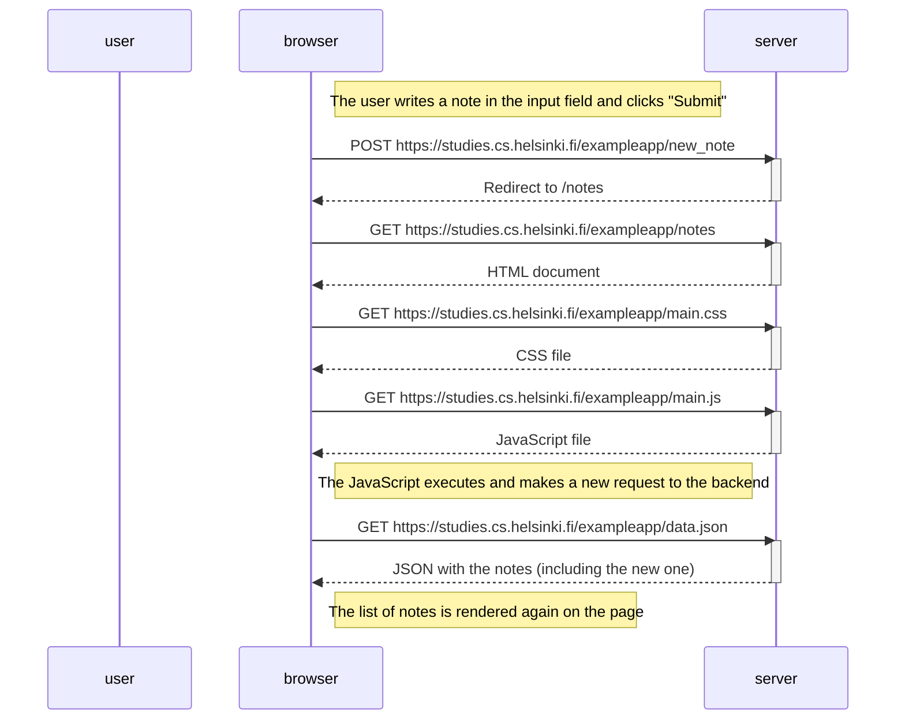

# Exercício 0.4: Novo diagrama das notas

Este diagrama mostra o fluxo de eventos quando o usuário **cria uma nova nota** na página `https://studies.cs.helsinki.fi/exampleapp/notes`.

```mermaid
sequenceDiagram
    participant user
    participant browser
    participant server

    Note right of browser: The user writes a note in the input field and clicks "Submit"

    browser->>server: POST https://studies.cs.helsinki.fi/exampleapp/new_note
    activate server
    server-->>browser: Redirect to /notes
    deactivate server

    browser->>server: GET https://studies.cs.helsinki.fi/exampleapp/notes
    activate server
    server-->>browser: HTML document
    deactivate server

    browser->>server: GET https://studies.cs.helsinki.fi/exampleapp/main.css
    activate server
    server-->>browser: CSS file
    deactivate server

    browser->>server: GET https://studies.cs.helsinki.fi/exampleapp/main.js
    activate server
    server-->>browser: JavaScript file
    deactivate server

    Note right of browser: The JavaScript executes and makes a new request to the backend

    browser->>server: GET https://studies.cs.helsinki.fi/exampleapp/data.json
    activate server
    server-->>browser: JSON with the notes (including the new one)
    deactivate server

    Note right of browser: The list of notes is rendered again on the page

```