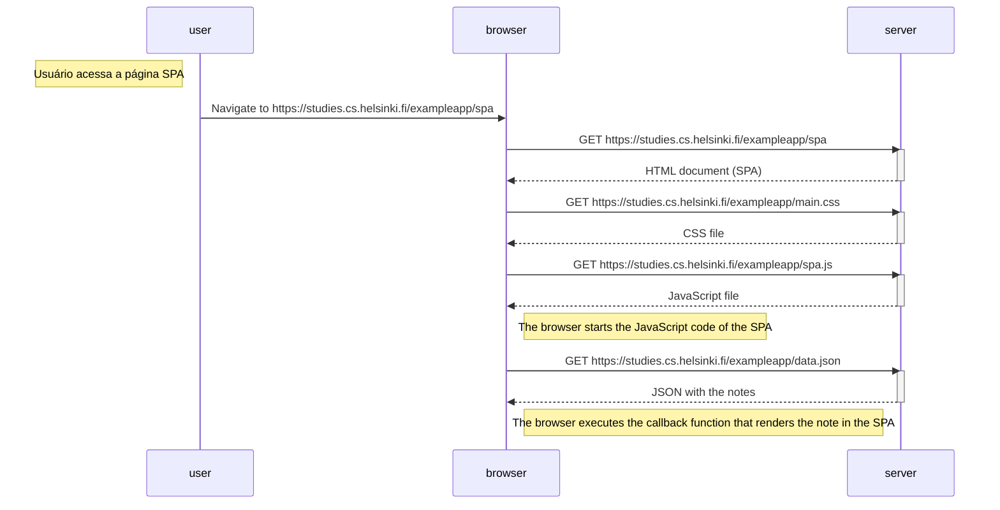

# Exercício 0.5: Diagrama de SPA

Este diagrama representa o funcionamento da versão SPA da aplicação de notas (`/spa`). Após o carregamento inicial da página, todas as interações acontecem no navegador, sem recarregar a página.

