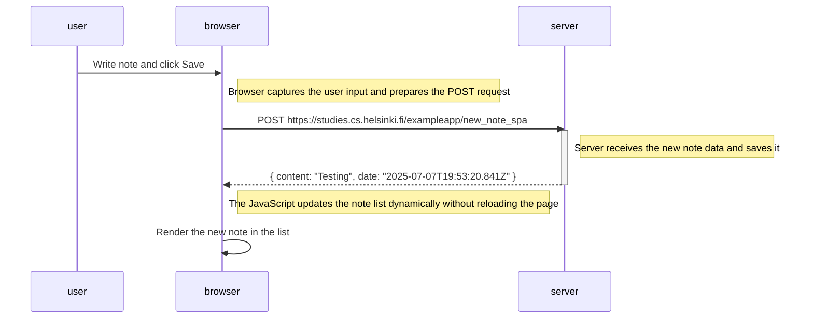

# Exercício 0.6: Nova nota no diagrama de SPA

Este diagrama representa o que acontece quando o usuário **cria uma nova nota na versão SPA** da aplicação de notas (`https://studies.cs.helsinki.fi/exampleapp/spa`).

